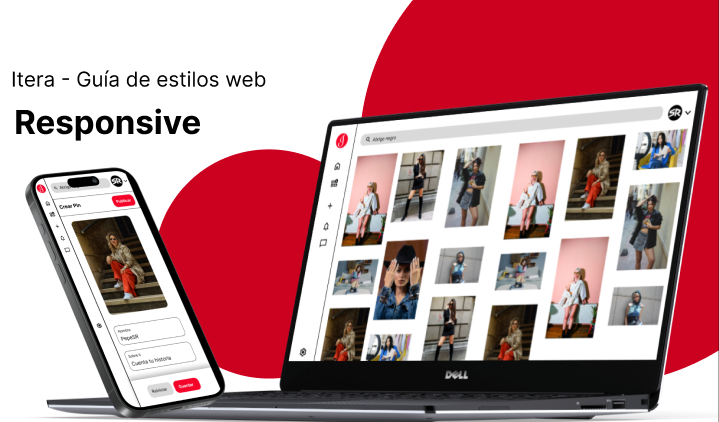
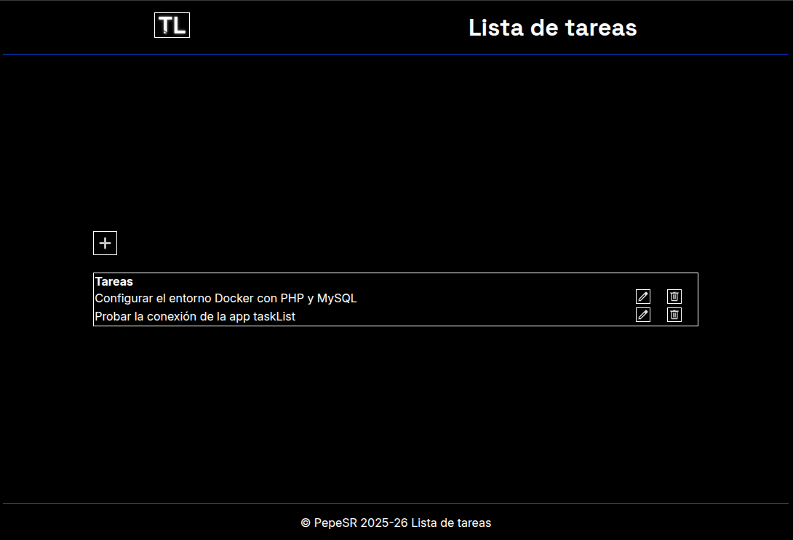

<h1 align="left">¡Buenas! 👋</h1>

###

Me llamo José Serrano Salguero. 
Vivo en Jerez de la frontera, Cádiz. 
Desarrollador de Aplicaciones Web 
Actualmente busco empleo.

  
📬 **Contactamé** a través de [linkedIn](https://www.linkedin.com/in/jose-serrano-1ew4901/) 

###

<h2 align="left">Sobre mi.</h2>

###

✨ Desarrollo aplicaciones web desde 2024. 
💼 Actualmente estoy buscando empleo. 
🎯 Meta: Ser un desarrollador web 10/10 
🎲 Trato de crear Aplicaciones sólidas y limpias.

###

<h2 align="left">Mis herramientas favoritas</h2>

  <!--vscode-->
  
  
  <!--docker-->
  
  <!--git-->
  
  
  <!--gitHub-->
  
  
  <!--jest-->
  
  
  <!--node-->
  
    

  <!--typescript-->
  
  
  <!--js-->
  
  
  <!--java-->
  
    

  <!--mysql-->
  
    
  <!--php-->
  
  
  <!--laravel-->
  
    

  
  <!--html5-->
  
  
  <!--css-->
  
  
  <!--tailwind-->
  
  
<!--bootstrap-->
  
  
  <!--vue-->
    

  <!--figma-->
  
  
  <!--behance-->
  

  
  

  

<h2 align="left">Sigue mi progreso</h2>

###

  
  <!--behance-->
  
  
  

###

<h2 align="left">Proyectos</h2>

<a href="https://github.com/pepesr-dev/itera">
<h3 align="left">Itera</h3>
</a>

<figure>  
          
    <figcaption>
      Aplicación web que replica el diseño y las funcionalidades de Pinterest.
      </figcaption>
</figure>

 <a href="https://github.com/pepesr-dev/taskList">
<h3 align="left">Task List</h3>
</a>
<figure> 
          
    <figcaption>    
      Aplicación web para gestionar tareas.
    </figcaption>

</figure>

 

Estas y otras apps las mantengo en desarrollo. 

###

📬 [**Contactamé**](https://www.linkedin.com/in/jose-serrano-1ew4901/) para saber más!